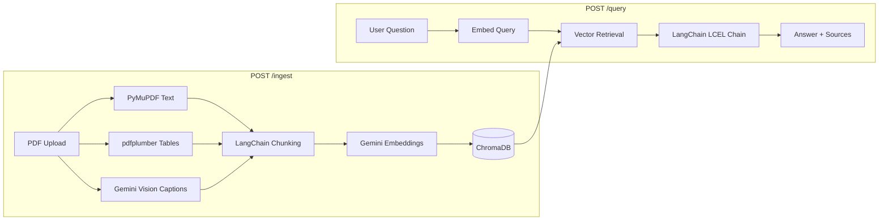

# AI Engineer Intern Technical Test

> Multimodal RAG API + Layout-Aware Text Extraction Pipeline

This repository contains two deliverables for the AI Engineer Intern technical test:

1. **Multimodal RAG REST API** — Ingests the Bank Mandiri 2025 PDF (text, tables, charts, infographics) into a searchable knowledge base, then answers questions via a REST API with page-level source metadata.
2. **Layout-Aware Text Extraction** — Converts slide presentation images into editable HTML overlays using OCR, with text inpainting to eliminate double-text artifacts.

---

## Architecture



### RAG Pipeline Flow

```text
PDF upload
  → PyMuPDF text extraction (per-page)
  → pdfplumber table extraction → Markdown format
  → Gemini Vision page captions for chart/infographic pages (4, 6, 8, 9)
  → LangChain RecursiveCharacterTextSplitter chunking
  → GoogleGenerativeAIEmbeddings (LangChain interface)
  → ChromaDB persistent vector store (cosine similarity)
  → DocumentRetriever (LangChain BaseRetriever)
  → LangChain LCEL chain (ChatPromptTemplate → ChatGoogleGenerativeAI → StrOutputParser)
  → Answer with page-level source metadata
```

---

## Tech Stack

| Component | Technology |
|-----------|-----------|
| API Framework | FastAPI + Uvicorn |
| Orchestration | **LangChain** (LCEL chain, BaseRetriever, Embeddings interface) |
| Vector DB | ChromaDB (persistent, cosine similarity) |
| LLM | Gemini (via `langchain-google-genai`) |
| Embeddings | GoogleGenerativeAIEmbeddings (LangChain) |
| PDF Parsing | PyMuPDF + pdfplumber |
| Visual Captioning | Gemini Vision (google-genai SDK) |
| OCR (Task B) | EasyOCR / PaddleOCR / Tesseract (auto-fallback) |
| Text Inpainting | OpenCV `cv2.inpaint()` |
| Containerization | Docker + Docker Compose |

---

## Setup

```bash
# Clone and create virtual environment
git clone <repository-url>
cd vision-rag-document-system

python -m venv .venv
# Windows:
.\.venv\Scripts\activate
# Linux/Mac:
source .venv/bin/activate

pip install --upgrade pip
pip install -r requirements.txt

# Configure environment
copy .env.example .env   # Windows
# cp .env.example .env   # Linux/Mac
```

Edit `.env` and set your Gemini API key:

```ini
GEMINI_API_KEY=your_google_ai_studio_key
GEMINI_GENERATION_MODEL=gemini-3-flash-preview
GEMINI_EMBEDDING_MODEL=gemini-embedding-2
EMBEDDING_DIM=768
```

> **Note:** `LOCAL_FALLBACK_EMBEDDINGS=true` allows local smoke tests without an API key. For the real demo, always set `GEMINI_API_KEY`.

### Docker Setup (Alternative)

```bash
docker compose up --build
```

The API will be available at `http://localhost:8000`.

---

## Run API

```bash
uvicorn app.main:app --reload
```

Open Swagger UI: [http://127.0.0.1:8000/docs](http://127.0.0.1:8000/docs)

Health check:

```bash
curl http://127.0.0.1:8000/health
```

---

## API Endpoints

### `POST /ingest` — Upload & Process PDF

```bash
curl -X POST "http://127.0.0.1:8000/ingest" \
  -F "file=@input/Laporan Keuangan Bank Mandiri 2025.pdf"
```

Response:

```json
{
  "document_id": "laporan_keuangan_bank_mandiri_2025",
  "filename": "Laporan Keuangan Bank Mandiri 2025.pdf",
  "pages_processed": 9,
  "chunks_created": 40,
  "tables_extracted": 3,
  "visual_chunks_extracted": 4,
  "status": "success"
}
```

### `POST /query` — Ask a Question

```bash
curl -X POST "http://127.0.0.1:8000/query" \
  -H "Content-Type: application/json" \
  -d '{
    "document_id": "laporan_keuangan_bank_mandiri_2025",
    "question": "Apakah penagihan boleh dilakukan pada jam 21.00?",
    "top_k": 5
  }'
```

Response (always includes source metadata):

```json
{
  "answer": "Tidak boleh. Penagihan hanya dapat dilakukan pukul 08.00 sampai dengan 20.00 waktu wilayah domisili debitur.",
  "sources": [
    {
      "chunk_id": "laporan_keuangan_bank_mandiri_2025_page_007_text",
      "page": 7,
      "type": "text",
      "score": 0.82,
      "excerpt": "Penagihan hanya dapat dilakukan pada pukul 08.00 sampai dengan 20.00..."
    }
  ]
}
```

### Debug Endpoints

| Method | Endpoint | Description |
|--------|----------|-------------|
| `GET` | `/health` | Health check |
| `GET` | `/documents` | List ingested documents |
| `GET` | `/documents/{id}/chunks` | View document chunks |
| `DELETE` | `/documents/{id}` | Delete a document |

---

## Evaluation

### Golden Questions

The system is evaluated against six official questions covering different content types:

| # | Question Type | Source | Page |
|---|--------------|--------|------|
| 1 | Text retrieval | Peran Unit Pelindungan Nasabah | 7 |
| 2 | Text reasoning | Penagihan jam 21.00 | 7 |
| 3 | Table retrieval | Pertumbuhan sektor Tambang & Konstruksi | 4 |
| 4 | Chart understanding | Komposisi DPK 2024 & 2025 | 6 |
| 5 | Infographic understanding | Alur penanganan pengaduan | 8 |
| 6 | Image text extraction | Saluran pengaduan | 9 |

### Run Automated Evaluation

```bash
# Start the API first, then:
python eval/run_eval.py
```

Output:

```
============================================================
EVALUATION SUMMARY
============================================================
  Questions tested       : 6
  Retrieval Hit@5        : 100%
  Source Page Accuracy    : 100%
  Avg Keyword Recall     : 85%
  Avg Latency            : 2300ms
============================================================
```

Results are saved to `eval/eval_results.json`.

---

## Layout-Aware Text Extraction (Task B)

### Run Pipeline

Process a single slide:

```bash
python -m layout_extraction.extract_layout \
  --input "input/Profile Image Studio  Let's Enable Digital Transformation with Us (2)_page-0001.jpg" \
  --output-dir layout_extraction/outputs
```

Process all slides:

```bash
python -m layout_extraction.extract_layout \
  --input-dir input \
  --output-dir layout_extraction/outputs
```

### Features

- **Multi-engine OCR**: EasyOCR → PaddleOCR → Tesseract (auto-fallback)
- **Style detection**: Font size estimated from bbox height, text color from foreground pixel analysis
- **Text inpainting**: OpenCV `cv2.inpaint()` removes **only** the text regions from the background, preserving all graphics and images
- **Editable HTML**: All text spans have `contenteditable="true"` — click any text to edit it
- **Clean output**: Inpainted background + HTML text overlay = no double-text artifacts

### Disable Inpainting

```bash
python -m layout_extraction.extract_layout --input-dir input --no-inpainting
```

### Output Files

| File | Content |
|------|---------|
| `*.layout.json` | Extracted text, bbox, color, font size, confidence |
| `*.html` | Slide background + editable text overlay |
| `*_clean.png` | Inpainted background (text removed) |

---

## Testing

```bash
# Unit tests
pytest tests/test_parser_helpers.py tests/test_chunker_embedder.py tests/test_response_schema.py -v

# Integration tests
pytest tests/test_integration.py -v

# All tests
pytest -v
```

---

## Engineering Best Practices

This project implements:

- **Modular FastAPI architecture** — Separation of concerns: `api/`, `rag/`, `core/`, `layout_extraction/`
- **LangChain orchestration** — LCEL chain, BaseRetriever, Embeddings interface
- **Environment-based configuration** — `pydantic-settings` with `.env` file, no hardcoded secrets
- **Metadata-first design** — Every response includes page, content type, score, and excerpt
- **Golden-question evaluation** — Automated script with retrieval hit, keyword recall, and latency metrics
- **Unit and integration tests** — pytest with TestClient
- **Structured logging** — Configurable log level, meaningful log messages
- **Docker deployment** — Multi-stage Dockerfile + docker-compose
- **Security** — `.env` in `.gitignore`, HTML text escaping, file upload validation

---

## Demo Script

1. Show repo structure and `.env.example`
2. Start `uvicorn app.main:app --reload`
3. Open Swagger UI at `/docs`
4. Call `POST /ingest` with the Bank Mandiri PDF
5. Call `POST /query` for each of the six evaluation questions
6. Highlight that each answer includes `sources.page`
7. Run `python eval/run_eval.py` to show automated evaluation
8. Run layout extraction for slide images
9. Open generated HTML in browser — edit text, show inpainting
10. Explain limitations and future improvements

---

## Limitations

- Visual chart/infographic extraction depends on Gemini Vision quality and the pages configured in `VISUAL_CAPTION_PAGES`
- Table extraction depends on the PDF table structure detected by pdfplumber
- HTML overlay uses OCR-estimated font size/color — close but not pixel-perfect
- Inpainting works best on solid-color backgrounds; complex textures may show artifacts
- No hybrid retrieval (BM25 + vector) in current version

## Future Improvements

- Hybrid retrieval with BM25 + vector search for better numeric/keyword queries
- Cross-encoder reranking for improved top-k precision
- Full-page OCR fallback for scanned PDFs
- Async ingestion with job status tracking
- Prompt versioning and A/B testing
- Cost and token usage tracking
- Frontend UI for interactive document QA
